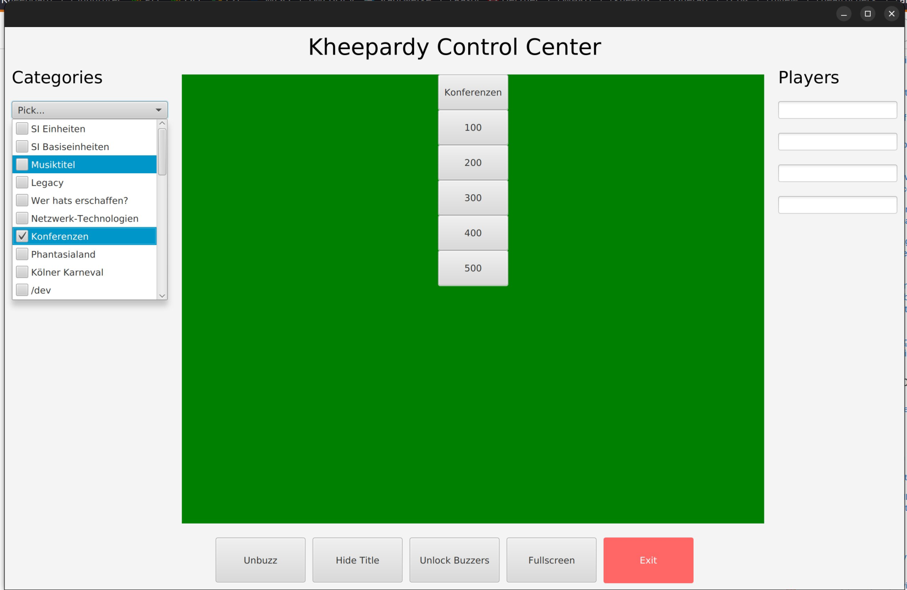

# Kheepardy (GL no less ;)

Start game:

```
./gradlew run
```

## Define Answers

Answers must be defined in `categories` folder.

Each category must be placed in a subfolder within `categories`.

A `data.yaml` must be placed into this subfolder which defines the answers for that category:

E.g. category `/dev`:

```
categories
 +---> dev
       +---> data.yaml
```

With `data.yaml`:

```
name: "/dev"
answers:
  - answer: "Entgegen des Namens werden hier keine Nullen geliefert."
    question: "Was ist /dev/null?"
  - answer: "Die Quelle von (mehr oder weniger) zufälligen Daten."
    question: "Was ist /dev/random (oder urandom)?"
  - answer: input.jpg
    question: "Was ist /dev/stdin?"
  - answer: "Fehler, Fehler und noch mehr Fehler (oder nix, wenn alles gut geht)"
    question: "Was ist /dev/stderr"
  - answer: "/dev/fb0"
    question: "Was ist das (erste) Framebuffer-Device?"
```

Note that images can be defined as answers, too.

Just put the image file into the same folder as `data.yaml` and set answer to its filename.


## Prepare and start a game

Below the admin panel is shown. All actions are performed there.

All categories will show up in the category selection box.

Just check all categories you want to have in around and hit "Start Game" (which still is "Hide Title"
in this screenshot, oops).



## Controlling the game

After a player decided on a tile, just click that.

You have to start the timer manually.

After that the buzzers are activated. 

Once a player has pushed the buzzer (frantically most times), new buttons
will appear: "Correct" and "Wrong".

"Correct" progresses the game, "Wrong" opens the buzzers up to other players.

That is pretty much all there is to say, as from here on out the game loop repeats.

## Knows Issues

# Fonts loading errors

At startup there may be errors related to fonts not loading:

```
Could not load font!
java.io.IOException: Problem reading font data.
        at java.desktop/java.awt.Font.createFont0(Font.java:1208)
        at java.desktop/java.awt.Font.createFont(Font.java:1076)
        at de.quippy.javamod.system.Helpers.<clinit>(Helpers.java:121)
        at org.khee.kheepardygl.scenes.TitleScene.run(TitleScene.java:158)
        at java.base/java.lang.Thread.run(Thread.java:840)

java.io.IOException: Stream closed
        at java.base/java.io.BufferedInputStream.getInIfOpen(BufferedInputStream.java:157)
        at java.base/java.io.BufferedInputStream.fill(BufferedInputStream.java:244)
        at java.base/java.io.BufferedInputStream.read1(BufferedInputStream.java:284)
        at java.base/java.io.BufferedInputStream.read(BufferedInputStream.java:343)
        at java.base/java.io.FilterInputStream.read(FilterInputStream.java:106)
        at de.quippy.sidplay.resid_builder.resid.Wave.readArrayFromStream(Wave.java:100)
        at de.quippy.sidplay.resid_builder.resid.Wave.<clinit>(Wave.java:59)
        at java.base/java.lang.Class.forName0(Native Method)
        at java.base/java.lang.Class.forName(Class.java:375)
        at de.quippy.javamod.system.Helpers.registerAllClasses(Helpers.java:1615)
        at org.khee.kheepardygl.scenes.TitleScene.run(TitleScene.java:158)
        at java.base/java.lang.Thread.run(Thread.java:840)
...
```

These do not impact the game experience and can be ognored for now.

## No restart button

There currently is no button to restart a game.

For now please use the "EXIT" Button and restart :)


