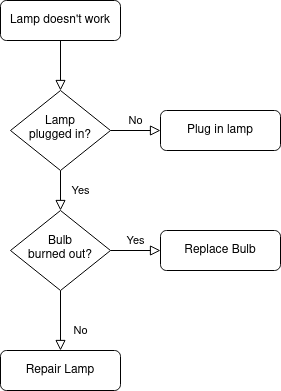
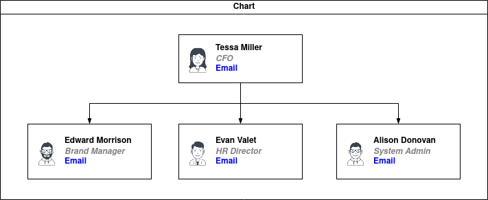
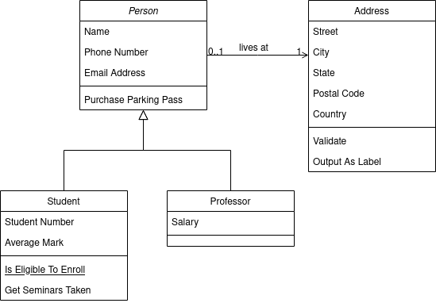
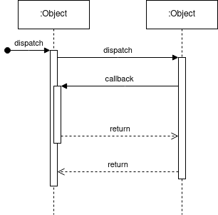
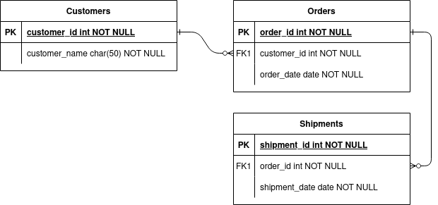

## Diagrammtypen

## 100

- Antwort:

- Erwartete Frage:

Was ist ein Ablaufdiagramm?

## 200

- Antwort:

- Erwartete Frage:

Was ist ein Organigramm?

## 300

- Antwort:

- Erwartete Frage:

Was ist ein Klassendiagramm?

## 400

- Antwort:

- Erwartete Frage:

Was ist ein Sequenzdiagramm?

## 500

- Antwort:

- Erwartete Frage:

Was ist ein Entity-Relationship-Diagramm?
